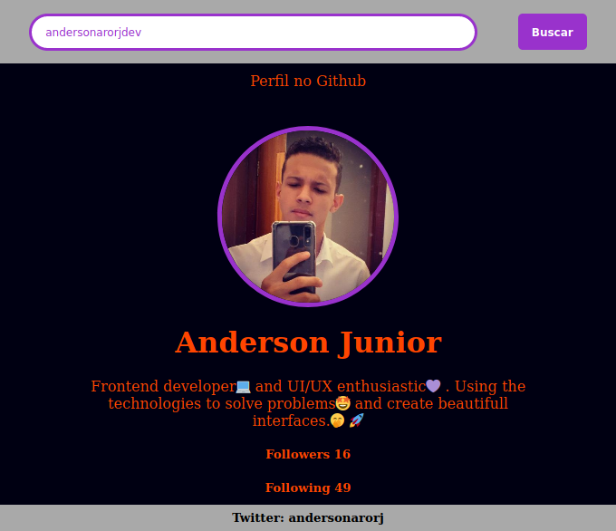
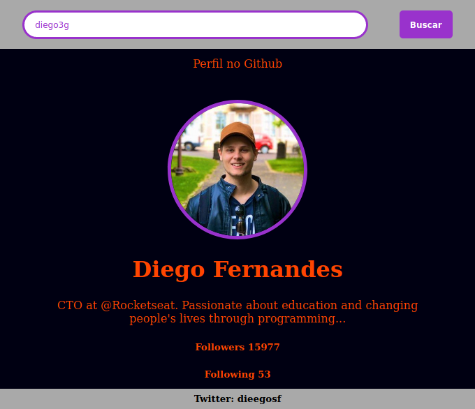

<h1 align="center">Welcome to Js-assync 👋</h1>
<p>
  
  <a href="LICENSE" target="_blank">
    
  </a>
  <a href="https://twitter.com/andersonarorjdev" target="_blank">
    
  </a>
</p>


<h4>Repository build to test and pratice consuming and usage of API's.🔎</h4>

> This Project was build to praticing and create amazing applications using free API'S.🚀

***

 ## Github User Searcher < Project 1>
 <p align="center">
    
 </p>

  <p align="center">
    
 </p>

## Downloading project ⬇️
```sh
  git clone https://github.com/andersonarorjdev/Js-assync.git
```
## Starting the server to see the project 💻
```sh
  acess : ajax/index.html on your browser.
```
## Author

👤 **Andersonarorjdev**

* Website: https://andersonarorjdev.github.io
* Twitter: [@andersonarorjdev](https://twitter.com/andersonarorjdev)
* Github: [@andersonarorjdev](https://github.com/andersonarorjdev)
* LinkedIn: [@andersonarorjdev](https://linkedin.com/in/andersonarorjdev)

## Show your support

Give a ⭐️ if this project helped you!

## 📝 License

Copyright © 2020 [Andersonarorjdev](https://github.com/andersonarorjdev).<br />
This project is [MIT](LICENSE) licensed.